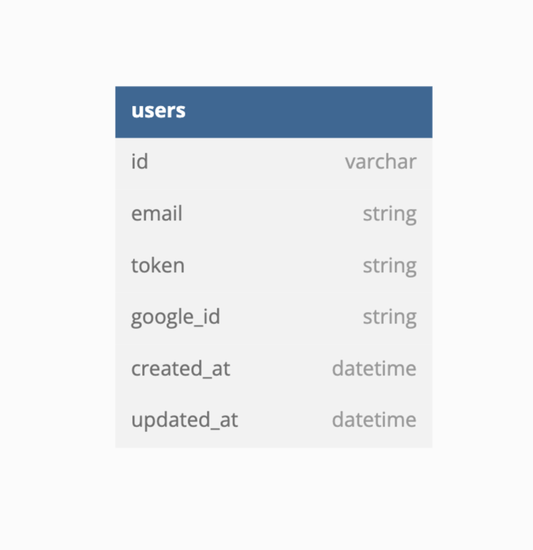

# IONO (Backend) API 

This API provides restaurant information based on a user's location (IP Address). It also can create users (or find existing users) to store in the database.

## Install

`bundle install`<br>
`rails db:{create, migrate}`

## Database / Schema



# REST API
## Get Restaurants
Returns 40 restaurants close to the location of the device IP address.
### Request 

GET '/api/v1/restaurants'

    curl -i -H 'Accept: application/json' http://localhost:5000/api/v1/restaurants
### Response Body

```
{
    "businesses": [
        {
            "id": "dnJvyhSPiIVlmpdM_3SCrg",
            "alias": "snooze-an-a-m-eatery-denver-12",
            "name": "Snooze, an A.M. Eatery",
            "image_url": "https://s3-media4.fl.yelpcdn.com/bphoto/cniSi66T4iS6nqCdML6HUQ/o.jpg",
            "is_closed": false,
            "url": "https://www.yelp.com/biz/snooze-an-a-m-eatery-denver-12?adjust_creative=HXaFGsDa_NpgBlPglTMuTA&utm_campaign=yelp_api_v3&utm_medium=api_v3_business_search&utm_source=HXaFGsDa_NpgBlPglTMuTA",
            "review_count": 4795,
            "categories": [
                {
                    "alias": "breakfast_brunch",
                    "title": "Breakfast & Brunch"
                },
                {
                    "alias": "cocktailbars",
                    "title": "Cocktail Bars"
                },
                {
                    "alias": "tradamerican",
                    "title": "American (Traditional)"
                }
            ],
            "rating": 4.5,
            "coordinates": {
                "latitude": 39.75544,
                "longitude": -104.98883
            },
            "transactions": [
                "delivery"
            ],
            "price": "$$",
            "location": {
                "address1": "2262 Larimer St",
                "address2": "",
                "address3": "",
                "city": "Denver",
                "zip_code": "80205",
                "country": "US",
                "state": "CO",
                "display_address": [
                    "2262 Larimer St",
                    "Denver, CO 80205"
                ]
            },
            "phone": "+13032970700",
            "display_phone": "(303) 297-0700",
            "distance": 1839.4484424332475
        } ]
}
```

## Create a New User
Creates a new user or finds an existing user by email. If the user already exists, it updates the "token" attribute of the user in the database.
### Request 

POST '/api/v1/users'

    curl -d '{"email":"rebecka@gmail.com", "token":"kshaskdjh", "google_id":"123"}' -H "Content-Type: application/json" -X POST http://localhost:5000/api/v1/users

### Response Body

```
{"data":
    {"id":"6",
    "type":"user",
    "attributes":{
        "id":6,
        "email":"rebecka@gmail.com",
        "token":"kshaskdjh",
        "google_id":"123"}
    }
}
```
<a href='app/documentation/IONO - API.postman_collection.JSON'>Postman collection JSON file</a>


<!-- [Postman collection JSON file]('https://github.com/IONO-where-to-eat/iono_be/tree/main/app/documentation/IONO - API.postman_collection.JSON') -->
